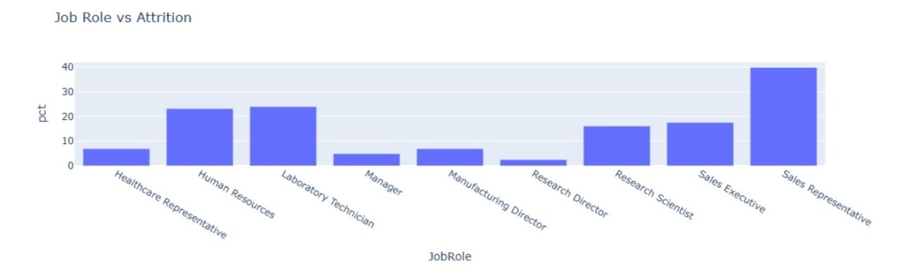

## HR Employee Attrition Analysis

## Objective

Analyze 1,470 IBM employee records to identify the key factors associated with employee attrition.

## Dataset

1,470 employee records from IBM.

## Tools

Python, Pandas, Plotly

## Methodology

1. Explored the dataset and validated data quality.
2. Performed exploratory data analysis (EDA).
3. Analyzed attrition across demographic, job-related, and satisfaction factors.
4. Identified high-risk employee profiles and attrition patterns.

## Key Questions

1. Does time spent at the company affect employee attrition?
2. Does the number of years with the same manager affect employee attrition?
3. Does time since the last promotion affect employee attrition?
4. Do satisfaction levels affect employee attrition?

## Key Findings

- Single employees show the highest attrition rate (25.5%), compared to 12% for married employees and 10% for divorced employees.

- The Sales and Human Resources departments show the highest attrition rates (20% and 19%), while Research & Development has a lower attrition rate of 13%.

- Sales Representatives have the highest attrition rate (39.75%) and the lowest average salary among major job roles, suggesting compensation may be a contributing factor.

- Employees who received a promotion within the last year but report low satisfaction levels show disproportionately high attrition rates.

- Low scores in environment satisfaction, job satisfaction, and relationship satisfaction are all associated with higher attrition rates, highlighting the importance of workplace wellbeing.

- Employees who travel frequently and report the lowest level of job satisfaction show a 40% attrition rate, compared to the company average of 16.1%, making them 2.5 times more likely to leave.

## Recommendations

1. Increase travel compensation and introduce flexible work arrangements for employees who travel frequently.

2. Review post-promotion career development programs to ensure recently promoted employees remain engaged and satisfied.

3. Reassess the compensation structure for Sales Representatives, who show both the highest attrition rate and the lowest average salary.

4. Implement a high-risk employee monitoring program targeting frequent travelers with very low job satisfaction levels.
5. 
